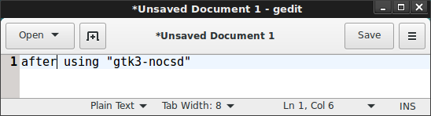

#gtk3-nocsd

gtk3-nocsd is a small module used to disable the client side decoration
of Gtk+ 3.

##Introduction:
Since Gtk+ 3.10, its developers added a so-called header bar or custom
title bar. With this and the client-side decoration, the original title
bar and window border provided by the window manager are disabled by
Gtk+. This makes all Gtk+ 3 programs look alike. Even worse, this may
break some window manager or compositors.

Unfortunately, the Gtk+ developers decided to be against the existing
standards and provide "no option" to turn it off.

Luckily, with gtk3-nocsd, we still have a way to (partially) turn it
off. Window manager (title bar and window border) can be re-enabled.

##Preview:
This is how the gtk3 windows look like before and after using
`gtk3-nocsd`.

#How to use:

* gtk3-nocsd should work with all Gtk+ 3 versions.

* Install necessary packages:

  * On Debian-based systems (including Ubuntu and Mint), install
    `pkg-config`, `libgtk-3-dev`, `libgirepository1.0-dev`.

  * On Fedora-based distros (including RHEL, CentOS), install
    `pkgconfig`, `gtk3-devel`, `gtk+-devel`, `gobject-introspection-devel`.

* Build the code. Run `make` from command line.
  After this you'll have the files `gtk3-nocsd`and `libgtk3-nocsd.so.0`
  in the same directory.

* Now to run individual Gtk+ 3 apps (say gedit) using this hack, use
  the command `./gtk3-nocsd gedit` from the same directory.

* To have all Gtk+ 3 apps (of current user) use this hack, export some
  environment variables in your `~/.bashrc`:

        export GTK_CSD=0
        export LD_PRELOAD=<"full path" of your libgtk3-nocsd.so.0 file>

* On Debian-based systems with graphical login, instead modify (or
  create) `~/.xsessionrc` and add the following code:

        if [ -n "$STARTUP" ]; then
          BASESTARTUP=${STARTUP%% *}
          BASESTARTUP=${BASESTARTUP##*/}
          if [ "$BASESTARTUP" = x-session-manager ]; then
            BASESTARTUP=$(basename $(readlink /etc/alternatives/x-session-manager))
          fi
          if [ x"$BASESTARTUP" = x"${BASESTARTUP#gnome-session}" ] ; then
            export GTK_CSD=0
            STARTUP="env LD_PRELOAD=/path/to/libgtk3-nocsd.so.0 $STARTUP"
          fi
        fi

  gtk3-nocsd is now packaged for Debian though (see below), so manual
  installation may not be necessary.

* Re-login to make the environment variables take effect.

* Hooray! GTK+ 3 client-side decorations are disabled now.

#Distribution packages:

gtk3-nocsd is packaged in Debian's unstable and testing distributions,
see [gtk3-nocsd in Debian's package database](https://packages.debian.org/testing/gtk3-nocsd).
The Debian package already comes with integration code to automatically
disable CSDs when installed, so after package installation only a
re-login is required to have CSDs disabled on non-GNOME desktops.

#How it works:

`$LD_PRELOAD` is used to override several Gdk and glib/gobject APIs to
intercept related calls Gtk+ 3 uses to setup CSDs. For older versions
of Gtk+ 3, while it is trying to initialize CSDs, it is led to believe
that there is no compositor available, so CSDs are not added. For later
Gtk+ 3 versions (3.16.1+), the `gtk_window_set_titlebar` method is
reimplemented, as tricking Gtk+ 3 into thinking the compositor is
disabled has side effects and is not sufficent anymore.

Additionally, as gtk_window_set_titlebar is also called from Gtk+
internally (and LD_PRELOAD cannot override function calls within a
library), several other places in Gtk+3 (e.g. buildable interfaces for
GtkWindow and GtkDialog) are also overridden to ensure that CSDs are
disabled.
